<h1 align="center">Software Engineering</h1>

> This is a summary of the concepts and practice of each DevOps tools that I've studied in the software engineering class.

# 1. Software Development methodology
## (1) Waterfall model
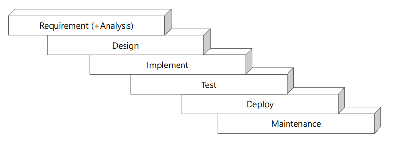
> 사실 말도 안됨...ㅎㅎ
### 문제

1. High Risk + Uncertainty
2. 최종 단계에 가서야 동작하는 SW 가 생산됨
3. 테스트 단계에서 단점이 발견되어도 수정하기 어려움
4. Requirement들이 자주 변경되는 SW 개발에 적용하기 어려움
5. 복잡한 SW 개발에 부적절
6. Object Oriented 프로젝트에 부적절

## (2) Agile Methodology

- Waterfall 모델을 개선하려고 전체 개발 프로젝트를 여러 단계의
- iteration으로 나눈 것
- 각 iteration 의 소요 시간은 동일해야 하며 대략 2~8주
- 각 iteration 마다 정해진 기능이 동작하는 SW 생산됨
    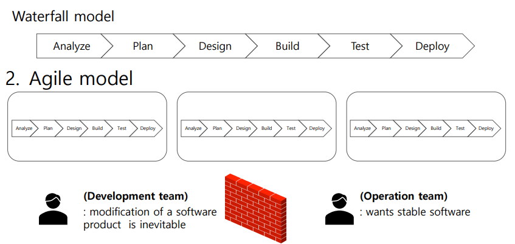

## (3) 결론

- "**구현 기술**"이 이러하기 때문에 이렇게 개발해야 한다 → 망하는 지름길
- "**목표**"를 결정 → 구현가능한 엔지니어를 고용해야함

<br><br>

# 2. 현재의 개발 방법론 및 Solution

## CI/CD(Continuous Integration / Continuous Delivery(Deploy))

- CI/CD 파이프라인은 더 자주 더 신뢰성 높은 수정된 코드를 deploy 할 수 있도록 DevOps 팀이 SW를 구현하는 방법
- Object Oriented SW design/implementation 기술 발전에 기인, 실제 복잡한 SW 개발자들의 누적된 경험에 의한 팀 문화적 산물
- DevOps SW 개발 도구들의 발전으로 꽃을 피우기 시작 
  -> DevOps 도구들을 사용하면 CI/CD가 강제적으로 수행됨

## DevOps

= CI / CD Methodology realized by a set of automation tools
    
    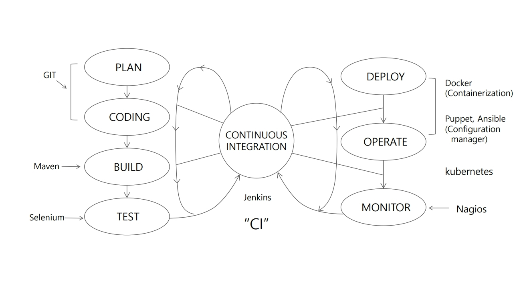

### DevOps 의 작동 방식

1. Continuous Development
2. Version control – **Git**, SVN
3. Automatic builder/packager to executables – Maven, Ant, Gradle
4. Continuous Testing – **Selenium**
5. Continuous Deployment – 실행 파일을 특정 서버 (테스팅 서버, production 서버)에 배포

    (a) Containerization (vs VM) – **Docker** + **Docker Swarm**

    (b) Configuration management – Puppet, **Ansible**

6. Continuous Monitoring – 네트워크 모니터링과 배포된 소프트웨어의 버그 및 사용자로부터의 feedback 수집 – **Nagios**
7. Continuous Integration – 위 모든 SW lifecycle의 도구들을 연합하고 연속적이고 자동적으로 각 작업이 수행되도록 함, 모든 위 도구들과 연동
    - **Jenkins** – 300개 이상의 plug-ins
    - cf) Kubernetes – Docker container orchestration manager (vs docker swarm)

<br><br>

# 3. Git & Github
### 목적 : Version Control

### DevOps 중 -  Code, Version control 에 해당

## 특징

- 분산 **VCS** (Version Control System)
- 다수의 개발자간 협력을 용이하게 하는 도우
- 코드 수정에 대한 tracking
- 수정 이력 편집 가능
- Local / Remote Repository

## Assignment1

### static website using github and template

> hosting url : https://justzino.github.io/hongik-software-engineering/

<br><br><br>

# 4. Docker

## 목적

- testing / staging / production의 시스템 환경이 달라서 생기는 문제를 해결하자
- 서로 다른 컴퓨팅 환경에서 애플리케이션을 안정적으로 실행할 수 있으며 개발 환경에 구애 받지 않고 빠른 개발과 배포가 가능하도록 하자

### DevOps 중 - Deploy/Operate 에 해당

<br>

## 어떻게 목적 달성?

- 개발 환경의 일관성 : 개발환경과 서비스 환경을 동일하게 만들자
- 모든 SW dependency를 "contain" 할 수 있는 SW container 를 만들어서 동일하게 구성하자

<br>

## 용어 정의 및 개념

- **Docker** = 컨테이너 기반의 **오픈소스 가상화** 플랫폼
    - OS 수준 가상화를 사용하여 컨테이너라는 패키지로 소프트웨어를 전달하는 PaaS(Platform as a Service) 플랫폼
- **Container** = 격리된 공간에서 프로세스가 동작하는 기술 / 이미지를 실행한 상태 (프로세스)
- **Image** = 컨테이너 실행에 필요한 파일과 설정값 등을 포함하고 있는 것
- **Dockerfile** = docker image를 만들기 위해 내리는 command들을 모아 둔 text 파일
    - `docker build` 사용 → image 생성
    - FROM, ADD, RUN, CMD, ENTRYPOINT, ENV
- **Docker Compose** = 다수의 container를 규정하고 실행하고 관리하는 Docker automation 도구 (YAML 파일)

<br>

## VM vs Docker

- 애플리케이션 간에 운영체제(OS)를 공유 → 가벼워짐
- ubuntu를 필요한 dependency 만 containerizing 하면서 가벼워짐 (GB → 50MB)
- OS 는 in-memory 되어야 하는데 유효한 main-meomory 가 엄청나게 늘어나므로 이는 엄청난 throughput 개선으로 이어짐
- VM과 마찬가지로 컨테이너에는 자체 파일 시스템, CPU 점유율, 메모리, 프로세스 공간 등이 있다
- 기본 인프라와의 종속성을 끊었기 때문에, 클라우드나 OS 배포본에 모두 이식할 수 있다.

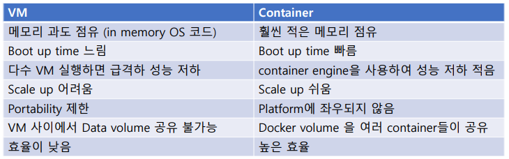

<br>

## Docker Container Volume

### 필요한 이유

- container가 run 명령에 의해 시작될 때는 read-only image로부터 시작되어 container의 filesystem은 read-only layer 위에 read-write layer로 만들어진 virtual filesystem 이다.
- 실제 Container를 시작한 후 만들어진 파일은 persistent filesystem에 저장된 것처럼 느껴지지만, 실제로는 디스크에 쓰여지는 것이 아니라 in-memory file system 에 쓰이는 것이므로, container가 종료되면 사라진다.
- 동일한 image로부터 container를 다시 만들면, 저장한 데이터는 사라지게 된다.
- 만약 DB를 사용하는 앱이라면, DB에 record 를 저장하였으나, container 가 종료되면 DB 테이블이 사라지게 된다.

⇒ 이러한 문제를 해결하기 위해 Container Volume을 제공

### Docker Volume 설명

- `-v <host path> : <mounting point path in container>`
- volume 을 mount 하여 실제 디스크에 영구적으로 데이터를 저장하여, container가 종료되어도 영구적으로 데이터를 저장할 수 있다
- but, 단점도 있다.
- container의 장점 중의 하나는 container들 사이에 filesystem을 통한 간섭이 없어서 보안이 뛰어나다는 것인데 volume 기능은 잘못된 코딩 또는 바이러스에 의해 이러한 장점이 훼손될 수 있다.

### Docker Volume 3가지 type

1. Host volume

    `docker run -v /home/mount/data:/var/lib/mysql/data`

    - 정확하게 mount할 경로를 지정
2. named volume

    `docker run -v name:/var/lib/mysql/data`

    - data 참조를 쉽게 하기 위해 이름으로 설정
3. Anonymous volume

    `docker run -v /var/lib/mysql/data`

<br>

## Container Engine Architecture

- Container는 hypervisor와 완전히 다릅니다. 궁극적으로는 hypervisor와 유사한 형태의 "가상화"를 목표로 하고 있지만 hypervisor는 OS 및 커널이 통째로 가상화되는 반면에 container는 간단히 보면 **filesystem의 가상화**만을 이루고 있습니다.
- container는 호스트 PC의 커널을 공유하고 따라서 init(1) 등의 프로세스가 떠있을 필요가 없으며, 따라서 가상화 프로그램과는 다르게 적은 메모리 사용량, 적은 overhead를 보입니다.

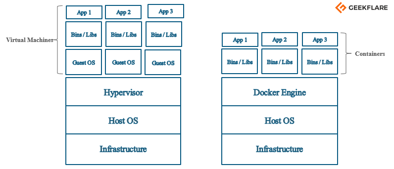
출처 : [https://geekflare.com/docker-architecture/](https://geekflare.com/docker-architecture/)

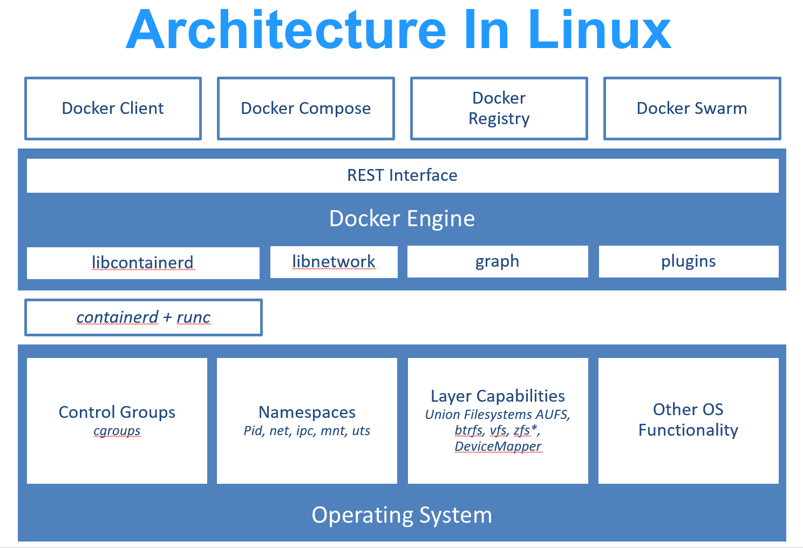
출처 : [https://docs.microsoft.com/en-us/virtualization/windowscontainers/deploy-containers/containerd](https://docs.microsoft.com/en-us/virtualization/windowscontainers/deploy-containers/containerd)

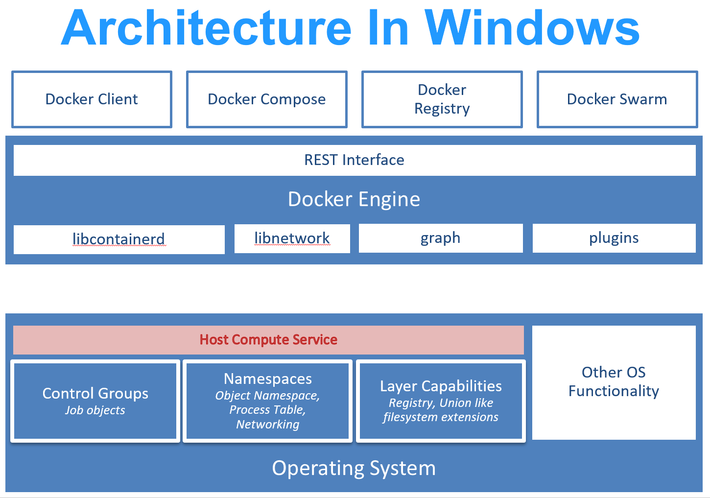
출처 : [https://docs.microsoft.com/en-us/virtualization/windowscontainers/deploy-containers/containerd](https://docs.microsoft.com/en-us/virtualization/windowscontainers/deploy-containers/containerd)

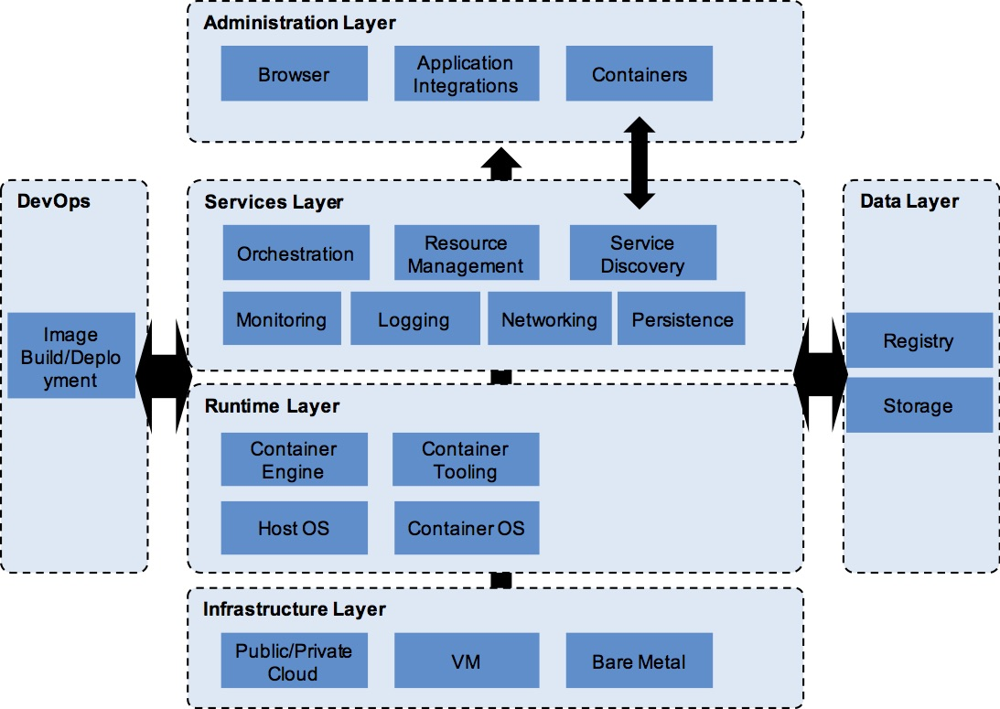
출처 : [https://accenture.github.io/blog/2016/04/14/the-lightweight-docker-runtime.html](https://accenture.github.io/blog/2016/04/14/the-lightweight-docker-runtime.html)

<br>

## 실습 - Apache-docker 

### Process

#### 1. Create AWS EC2 instance & Install Docker on ubuntu

```shell
$ apt-get update
$ apt-get install docker.io
$ docker --version
```

#### 2. Add a Dockerfile for apache server

- code : [apache server Dockerfile](hw2-wordpress\docker-compose.yml)

```dockerfile
FROM ubuntu
ARG DEBIAN_FRONTEND=noninteractive
RUN apt-get update
RUN apt-get install -y apache2
ADD . /var/www/html
ENTRYPOINT apachectl -D FOREGROUND
ENV test TestingENV
```

#### 3. Image build -> run

- port forwarding
- volume mount

#### 4. mount 시킨 ubuntu의 volume에 html 파일 생성 및 변경 후 container에 잘 적용 되었는지 확인

### Commands

#### 1. Docker Commands

```shell
$ docker pull ubuntu
$ sudo docker run -it -d [ubuntu]
$ sudo docker exec -it [container ID] bash
$ sudo docker build . -t [생성할 image이름]
# $ sudo docker run -it -p 5000:80 -v /home/ubuntu/[디렉토리 이름]:/var/www/html -d [image이름]
$ sudo docker run -it -p 5000:80 -v /home/ubuntu/docker:/var/www/html -d [image이름]

$ sudo docker rm -f $(sudo docker ps -a -q)
$ sudo docker rmi -f $(sudo docker images -a -q)
```

- /var/www/html/ 에 volume을 마운틴하는 이유 : apache의 index.html 파일이 해당 경로에 위치해 있기 때문
- /var/www/html/tmp.html 생성후 `서버주소/tmp.html` 접속 -> 제대로 mount 적용 되는지 확인

#### 2. Apache Commands

```shell
$ service apache2 status
$ service apache2 start
```

### Reference
- https://docs.docker.com/compose/wordpress/

<br><br>

# 5. docker-compose

## Assignment2

### wordpress, php, docker-compose를 사용한 웹 서비스 만들어 보기

- wordpress를 사용한 브라우저를 EC2 서버에 올리기

- 클라이언트에서 form 또는 button 같은 document object를 click 하여 서버로 데이터를 보내고 전송 받은 데이터에 따라 적절히 서비스를 다시 클라이언트에게 제공하는 dynamic 서비스를 wordpress를 이용하여 container로 만들어 봅니다.

- 만일 브라우저에서 데이터를 웹 서버에 보내어 그에 따라 서버가 여러분이 정해 놓은 작업을 수행하는 dynamic 서비스를 구현하는 방법을 모르거나 해 본 적이 없는 사람은 지난 번 static 웹 사이트 과제처럼 자기 이름 학번을 보여주는 wordpress 를 이용한 웹 서버를 container 로 만들어도 됩니다.

- dynamic 서비스를 만들 줄 아는 사람도 그냥 간단히 브라우저에서 이름을 입력하면 "안뇽, <입력한 이름>"이 브라우저에서 rendering 하는 매우 간단한 프로그램으로 충분하니 복잡한 서비스를 구현하여 너무 자랑하지 말기.

### Process

#### 1. docker-compose 설치

```shell
$ sudo curl -L https://github.com/docker/compose/releases/download/1.29.0/docker-compose-`uname -s`-`uname -m` -o /usr/local/bin/docker-compose
$ sudo chmod +x /usr/local/bin/docker-compose
$ docker-compose --version
```

#### 2. docker-compose.yml 추가

- [wordpress compose file 참고](https://docs.docker.com/compose/wordpress/)

```yml
version: "3.9"

services:
  db:
    image: mysql:5.7
    volumes:
      - db_data:/var/lib/mysql
    restart: always
    environment:
      MYSQL_ROOT_PASSWORD: somewordpress
      MYSQL_DATABASE: wordpress
      MYSQL_USER: wordpress
      MYSQL_PASSWORD: wordpress

  wordpress:
    depends_on:
      - db
    image: wordpress:latest
    ports:
      - "8000:80"
    restart: always
    environment:
      WORDPRESS_DB_HOST: db:3306
      WORDPRESS_DB_USER: wordpress
      WORDPRESS_DB_PASSWORD: wordpress
      WORDPRESS_DB_NAME: wordpress
volumes:
  db_data: {}
```

<br><br>

# 6. Monolithic App vs Microservices

## Monolithic App

- 모든 기능이 단일 프로그램 안에 구현됨
- 비현실적, 비효율, 매우 낮은 생산성
- 비대한 app, 일부가 update 되면 → 전체 app이 re-deploy 되어야 함.
- bug가 전체 app에 영향을 미침
- 새로운 기술을 채택하기에 장벽이 있음

## Microservices

- 거의 모든 응용, 특히 Web 기반 App 
(front-end + backend services including DB, login, search service, mail, etc.)
- 각 단일 서비스가 서로 loosely coupled
- Microservices 사이에서의 Communication은?
    - 프로그램 속에서 args 전달하는 대신에 HTTP 통신 프로토콜 등을 통한 데이터 교환
    ⇒ RESTful API (JSON)
    - 각 service 들은 bug 관점에서 상호 독립적
    ⇒ 획기적, 서로 다른 기술로 구현
- Monolithic App의 단점이 모두 장점으로!!

<br><br>

# 7. Docker Swarm
> “Container Orchestration tool"

## Docker Compose

- Compose 는 **동일 호스트에서** 두 개 이상의 컨테이너를 운영

## Swarm

- Swarm은 각 Container들을 cluster 하고 schedule 하여, 전체 Container 클러스터를 하나의 virtual 단일 Container로 관리
- 각 Container의 상태를 모니터링하여 컨테이너 수를 각 호스트에서 늘리거나 줄이며 운영하는 도구
- **여러 호스트에서** 다수의 컨테이너들을 운영(orchaestrate), 필요에 따라 컨테이너의 수를 늘리고 줄이는 auto-scaling 기능
  
  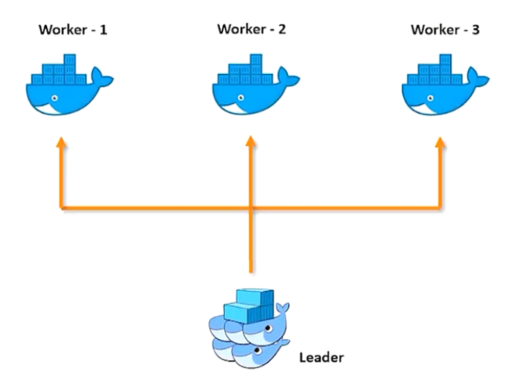

<br>

## 실습

- swarm을 이용하여 여러 호스트에서 다수의 Apache server 컨테이너 운영

### Process

#### 1. AWS EC2 instance 2 개 이상 생성

- master, workers instances
- 각 ubuntu 에 docker 설치

#### 2. master, worker ubuntu에 동일한 image build (or pull)

- 이 경우 위에서 사용했던 apache Dockerfile을 사용하여 image build

#### 3. master 노드에서 swarm init

```shell
$ sudo docker swarm init --advertise-addr=[private IP address]

$ sudo docker service ls
$ sudo docker node ls
$ sudo docker ps
```

> 결과
>
> ```shell
> Swarm initialized: current node (vhykgsb3y716xyy272ac2dvn0) is now a manager.
>
> To add a worker to this swarm, run the following command:
>
>     docker swarm join --token SWMTKN-1-2xlodjb3k3hqtyijpkxgb6dvhknwyy7ggkjkjdjbh31j6v8rm2-1n6zhwapbhzxq2txtsmkxqfkt [private IP address]:port
>
> To add a manager to this swarm, run 'docker swarm join-token manager' and follow the instructions.
> ```

#### 4. worker node 에서 swarm 으로 join

- 위의 swarm init 결과로 나온 command 를 worker node에서 실행

```shell
$ sudo docker swarm join --token SWMTKN-1-2xlodjb3k3hqtyijpkxgb6dvhknwyy7ggkjkjdjbh31j6v8rm2-1n6zhwapbhzxq2txtsmkxqfkt [private IP address]:port
```

#### 5. replicas 생성, 제거, scale 관리
- 아래의 commands 참고

### Commands

#### master node Commands

- Create a service (private IP 에 주의)

```shell
$ sudo docker swarm init --advertise-addr=[private IP address]
# $ sudo docker service create --name [service name] --replicas [num of replicas] -p [port mapping] [image name]
$ sudo docker service create --name apache --replicas 5 -p 5000:80 test
```

- Scale-up and down

```shell
# $ sudo docker service scale [service name]=[num of service instances]
$ sudo docker service scale apache=7
```

- ps list

```shell
$ sudo docker service ls
$ sudo docker node ls
$ sudo docker ps
```

- Remove a service

```shell
$ sudo docker swarm leave --force     # on master
# $ sudo docker service rm [service name]
$ sudo docker service rm apache
```

#### worker node Commands

- Connect to swarm

```shell
$ sudo docker swarm join --token SWMTKN-1-2xlodjb3k3hqtyijpkxgb6dvhknwyy7ggkjkjdjbh31j6v8rm2-1n6zhwapbhzxq2txtsmkxqfkt [private IP address]:port
```

- ps list

```shell
$ sudo docker ps
```

- Remove a service
```shell
$ sudo docker swarm leave     # on worker
```

<br><br>

# 8. Kubernetes(k8s)

> “Container Orchestration tool"

### DevOps 중 - Deploy/Operate 에 해당

## Kubernetes 정의

쿠버네티스는 컨테이너화된 워크로드와 서비스를 관리하기 위한 이식성이 있고, 확장가능한 오픈소스 플랫폼

- 분산 운영체제 with **no distributed file system**, **no cache management,** **no system calls**, **no per process control**, etc.
- Job control system on global scale of CDN/Service delivery network
- RAM (main memory)-aware throughput oriented
- no down time service via load balancing & auto scaling

    ⇒ **분산 OS가 DevOps 파라다임을 실현하는 플랫폼이 됨**

## 필요한 이유

- 컨테이너는 애플리케이션을 포장하고 실행하는 좋은 방법이다. 프로덕션 환경에서는 애플리케이션을 실행하는 **컨테이너를 관리하고 가동 중지 시간이 없는지 확인해야 한다**.
- **예를 들어 컨테이너가 다운되면 다른 컨테이너를 다시 시작해야 한다.** **이 문제를 시스템에 의해 처리한다면 더 쉽지 않을까?**

이것이 쿠버네티스가 필요한 이유이다!

## 어떻게?

쿠버네티스는 분산 시스템을 탄력적으로 실행하기 위한 프레임 워크를 제공한다. 애플리케이션의 확장과 장애 조치를 처리하고, 배포 패턴 등을 제공한다. 
예를 들어, 쿠버네티스는 시스템의 카나리아 배포를 쉽게 관리 할 수 있다.

## Docker Swarm vs Kubernetes(k8s)

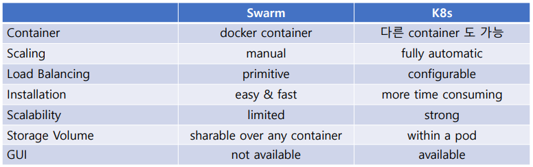

## k8s Architecture

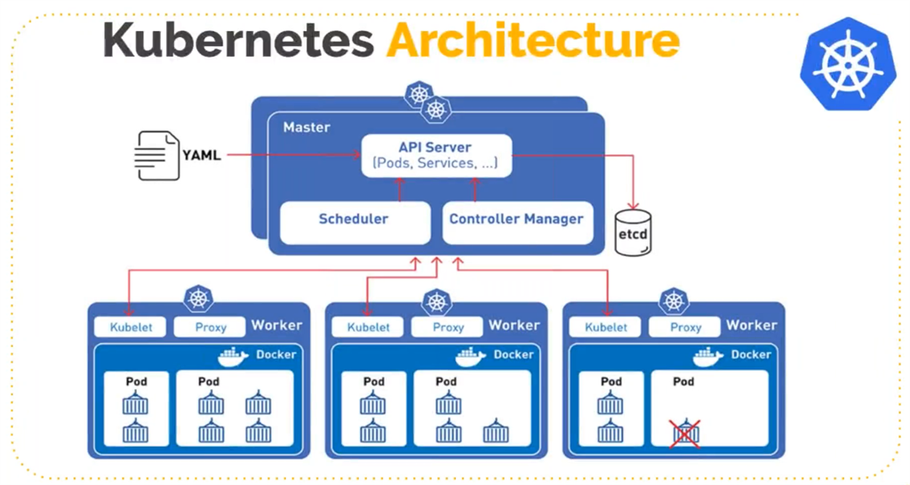

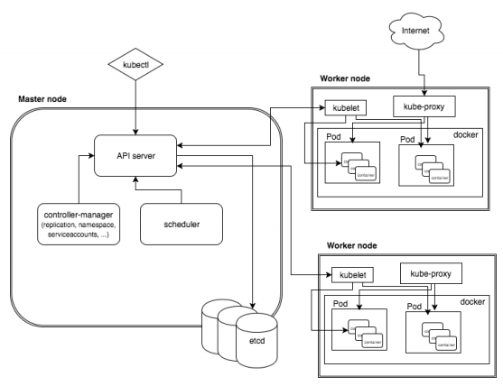

## Kubernetes Architecture

### Master Node Component

- kubectl
    - master node 에 명령을 내리는 CLI
- API Server
- Scheduler
- ETCD Server
    - 쿠버네티스의 기본 데이터 저장소
- Control Manager
    - Node Components
    - Kubelet
    - Pods
- Overlay Network

### Worker Node Components

- Kubelet
    - pod 관리
    - Container running을 책임
- Kube-Proxy
    - 각 node의 network proxy
    - 즉, Internet 연결
- Pod
    - 1개 이상의 docker container 포함

## Cluster Scalability

(v1.21, 2021 4월 기준)

하나의 클러스터에는

- node 당 최대 100 개 까지의 pod
- 최대 5000 개 까지의 node
- 최대 150,000 개 까지의 총 pod
- 최대 300,000 개 까지의 총 container

## k8s 장점

1. Automatic bin packing (RAM-aware performance based)
2. Service discovery & load balancing (DNS name for each service)
3. Storage orchestration
4. Self healing (restart failed containers)
5. Automated rollouts & rollbacks
6. Secret and configuration management (secret & config map in ETCD)
7. **Batch execution (run to completion)**
8. Horizontal scaling (CLI, UI, automatic based on CPU usage)

### 여기서 잠깐, 배치프로그램이란? (Batch Processing)

- 필요 상황 : 모인 대량의 데이터를 한번에 처리해야한다.
- 이 때, 스케쥴링 해서 time-out되면 switching 되면 엄청난 비효율 이기 때문에, 시작하면 끝날 때까지 프로세스를 돌린다.

1. 대량건의 데이터를 처리한다. (대규모 작업)

2. 특정 시간에 실행된다. (업무 시간이 아닌 새벽 시간 등)

3. 일괄적으로 처리한다.

## Why now? (2014)

Ans: 분산 OS에 대한 분명한 이해, CDN, Cloud Computing 성숙

## Install & Use K8s

## Reference

- 공식문서 : https://kubernetes.io/ko/docs/concepts/overview/what-is-kubernetes/
- **Cluster Scalability** : [https://kubernetes.io/docs/setup/best-practices/cluster-large/](https://kubernetes.io/docs/setup/best-practices/cluster-large/)
- **Batch Processing** : [https://limkydev.tistory.com/140](https://limkydev.tistory.com/140)

<br><br>

# 9. 구성 관리 tools (Configuration Management tools)

### DevOps 중 - Deploy, Operate 과정에 해당
## Configuration Management tools 의 개념

- IT 자동화 (Automation) 의 기본 도구
- Why automated CM?
    - 대규모 heterogeneous computer cluster 관리
        - 수백~수만 대 이상 서버/1500대 규모의 네트워크 장비
    - HW 모니터링
    - SW install
    - Environment 불일치 문제 해소 (cf. containerization)
    - Roll back 자동화
    - 부실한 CM은 Service Downtime에 가장 큰 요인

## 목적 : IaC (Infrastructure as Code)

- 수작업이 아닌 code를 제공하여 IT operations (build, deploy, manage)을 자동화하는 것
- 중앙에서 코드를 write하여 수백 대 이상의 기기에 Dev, Test, Production 환경을 제공(**provisioning**)함
- 환경의 배포와 구성을 규격화된 코드로 정의해 사용
- 인프라의 상태를 코드로 선언하고 이를 모든 서버에 배포함으로써 특정 환경을 동일하게 유지
- 환경 자동화 도구의 대표적인 예시가 앤서블
- 앤서블은 환경의 배포뿐만 아니라 서버 클러스터의 체계적인 관리, 확장 가능한 모듈의 사용 등 다양한 측면에서 사용될 수 있는 도구

## Shell script vs CM tool script

= shell script 기반 vs YAML 로 관리 사항을 기재 

= procedural vs declarative

### 공통점

각 서버/기기에 환경을 provisioning 하는 점에서는 동일 목표

1.  IT Automation
    - IT 업무자의 작업을 자동화하는 명령 기재
2.  Configuration Management
    - 전체 infrastructure 의 일관성을 유지
3.  Automatic Deployment
    - 다양한 환경에서 동작하는 앱들을 자동으로 배치(deploy)

### 차이점

- Shell script로 관리를 위한 코딩을 한다는 것은 모든 것을 scrip로 구현하는 것 
→ workflow/숙련도/일관성/upgrade 이슈
- **CM script는 훨씬 편리** → 이슈를 제거/자동처리
- CM Tool UI

## 도구 종류 : Puppet vs Chef vs Saltstack vs Ansible

- 어느 도구가 상대적으로 우수하다고 할 수 없음
1. Scalability
    - 4 개 도구 모두 scalability 우수 (수천 대 이상의 기기 동시 관리)
2. Ease of setup
    - Puppet/Chef/Saltstack : master-agent
    - Ansible : master only => fast (and **easy**) setup
3. Availability → Backup
    - Puppet, Saltstack : multi masters
    - Chef : backup chef
    - Ansible : primary/secondary server
4. Management
    - Puppet : not easy, DSL(domain specific language)
    - Chef : Ruby DSL program, not easy
    - Saltstack : easy to medium
    - Ansible : Easy (yaml)
5. Interoperability
    - Puppet, Chef, Saltstack : master only on linux
    - agents are on linux/windows
    - Ansible : sever on linux (as well as windows), clients on linux/windows
6. Configuration Languages
    - Puppet : Puppet DSL, not easy, admin 편의
    - Chef : Ruby DSL, difficult, 개발자 편의
    - Saltstack : YAML built on Python, easy
    - Ansible : YAML built on Python, easy
7. 인기도
    - Puppet/Chef : 점점 인기도 떨어짐
    - Saltstack : 낮음
    - Ansible : 현재 가장 널리 사용됨
8. 비용
    - 대략 연간 10,000달러 / 1,000대 기기
9. 누가 사용하나?
    - 모든 회사

### 실습에는 **Ansible 을 사용**

## CM Architectures

- Pull Architecture
- Agents (clients)가 주기적으로 master (server)에게 configuration 문의
- 독자적인 기능 추가 편리
- Push Architecture
- Server가 주기적으로 node들에 configuration을 주입
- No client side setup at all
- How? <= Shell command with root privileges
- SSH connection from server to machines
- 간편

# 10. Ansible - CM tools

### DevOps 중 - Deploy, Operate 과정에 해당

## About Ansible

- IT 자동화 도구
- 단순성과 사용 편의성에 중점
- 앤서블은 **에이전트가 없는 구조**이기 때문에 별도의 에이전트 설치가 필요 없다.
- 기존의 에이전트 역할을 **SSH** 데몬이 대체하기 때문에 SSH 접속만 가능한 서버라면 앤서블의 제어 대상이 될 수 있다.
- OpenSSH는 가장 많이 검토된 오픈 소스 구성 요소 중 하나이므로 보안 노출이 크게 줄어든다
- Ansible은 분산돼있으며 기존 OS 자격 증명을 사용하여 원격 컴퓨터에 대한 엑세스를 제어한다.

    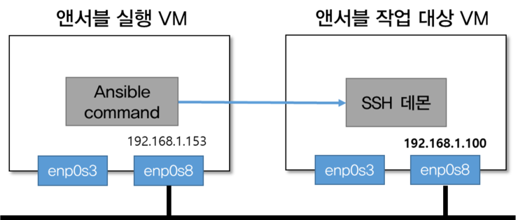

    출처 : [https://blog.naver.com/alice_k106/221333208746](https://blog.naver.com/alice_k106/221333208746)

## 내가 가졌던 의문

> k8s도 Deploy 과정에서 자동화를 해주는데 앤서블(ansible)은 왜 필요한가?

구글링을 통해 동일한 고민을 했던 분의 [블로그](https://medium.com/harrythegreat/%EC%BF%A0%EB%B2%84%EB%84%A4%ED%8B%B0%EC%8A%A4-ci-di-%EB%A5%BC-%EC%9C%84%ED%95%9C-%EC%98%A4%ED%94%88%EC%86%8C%EC%8A%A4-%ED%94%84%EB%A1%9C%EC%A0%9D%ED%8A%B8-%EC%95%8C%EC%95%84%EB%B3%B4%EA%B8%B0-a6657d429c26) 를 통해서 답을 찾을 수 있었다. 아래 내용은 해당 블로그의 내용을 빌려 적어놓았다.

## 필요한 이유

- 쿠버 네티스로 서비스를 돌려도 최소한 노드 컴퓨터에 최소한의 설정 하다못해 SSH 키나 docker sudo 설정이라도 해주어야 합니다.
- 규모가 작다면 문제가 되지 않겠지만 서비스의 규모가 늘어나면 늘어날수록 야근이 많아지게 됩니다.

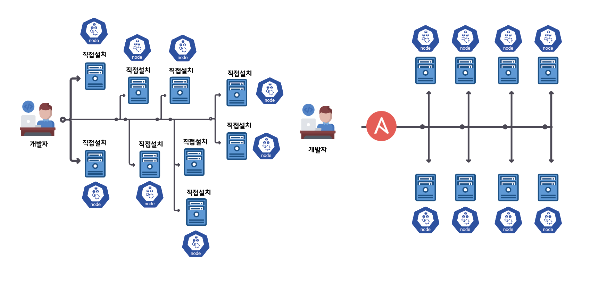

출처 : [https://medium.com/harrythegreat/쿠버네티스-ci-di-를-위한-오픈소스-프로젝트-알아보기-a6657d429c26](https://medium.com/harrythegreat/%EC%BF%A0%EB%B2%84%EB%84%A4%ED%8B%B0%EC%8A%A4-ci-di-%EB%A5%BC-%EC%9C%84%ED%95%9C-%EC%98%A4%ED%94%88%EC%86%8C%EC%8A%A4-%ED%94%84%EB%A1%9C%EC%A0%9D%ED%8A%B8-%EC%95%8C%EC%95%84%EB%B3%B4%EA%B8%B0-a6657d429c26)

- 앤서블은 이러한 기본적 **프로비저닝**과 설정 등을 자동화해줄 수 있으며 코드로서의 인프라(Infrastructure as Code)를 표방하기 때문에 playbook으로 명칭 되는 yaml형식의 문법으로 전체적인 인프라 프로비저닝을 관리할 수 있습니다.

    **프로비저닝** : 사용자의 요구에 맞게 시스템 자원을 할당, 배치, 배포해 두었다가 필요 시 시스템을 즉시 사용할 수 있는 상태로 미리 준비해 두는 것을 말한다.

- 게다가 JSON기반의 통신인 데다 SSH를 지원하기 때문에 다른 툴들에 비해 러닝 커브가 적습니다.

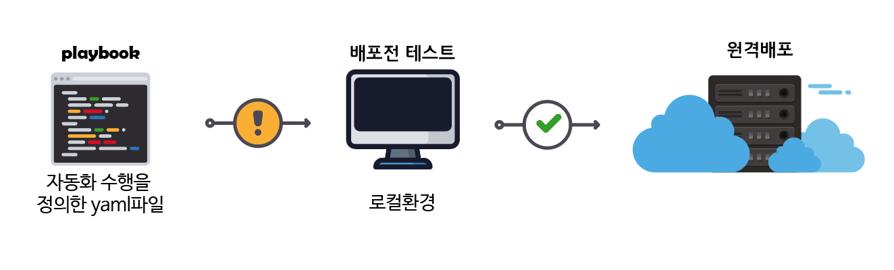

출처 : [https://medium.com/harrythegreat/쿠버네티스-ci-di-를-위한-오픈소스-프로젝트-알아보기-a6657d429c26](https://medium.com/harrythegreat/%EC%BF%A0%EB%B2%84%EB%84%A4%ED%8B%B0%EC%8A%A4-ci-di-%EB%A5%BC-%EC%9C%84%ED%95%9C-%EC%98%A4%ED%94%88%EC%86%8C%EC%8A%A4-%ED%94%84%EB%A1%9C%EC%A0%9D%ED%8A%B8-%EC%95%8C%EC%95%84%EB%B3%B4%EA%B8%B0-a6657d429c26)

## Ansible Architecture

Ansible은 클라우드 프로비저닝, configuration 관리, 어플리케이션 배포, 인프라-서비스 오케스트레이션 및 여러 기타 IT 요구사항을 자동화 하는 IT 자동화 엔진이다.

- Control node : Ansible이 설치된 (종류에 상관없이) 모든 시스템
- Managed nodes : Ansible로 관리하는 네트워크 장치 (and/or servers)

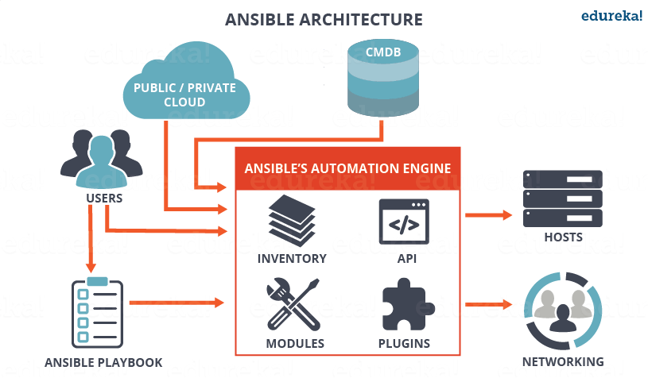

출처 : edureka!

- Tasks : Ansible의 작업 단위
    - Ad-Hoc Command : 단일 작업(task)을 수행하는 것
- playbook : 반복해서 실행하고자 해당 작업을 실행 순서대로 저장해 놓은 정렬된 작업 리스트
- Modules : Ansible 코드의 실행 단위
- Inventory : 관리되는 노드의 목록

## **멱등성(idempotence)**

- 엔서블 대해 이야기할 때 많이 나오는 용어가 **멱등성(idempotence)** 이다.
- **멱등성**이란 동일한 작업을 계속해서 수행해도 항상 동일한 결과가 나오는 것을 뜻하는 용어로
- 이미 프로비저닝 된 머신에 여러 번 Ansible로 배포되어도 항상 동일한 결과를 얻을 수 있도록 디자인되었습니다.

## 기본적인 Ansible command 또는 playbook

- 인벤토리에서 실행할 기계를 선택한다.
- 일반적으로 SSH를 통해 해당 시스템 (or 네트워크 장치 or 기타 관리 노드)에 연결한다.
- 하나 이상의 모듈을 원격 시스템에 복사하고, 거기서 실행을 시작한다.

## Reference

- [https://medium.com/harrythegreat/쿠버네티스-ci-di-를-위한-오픈소스-프로젝트-알아보기-a6657d429c26](https://medium.com/harrythegreat/%EC%BF%A0%EB%B2%84%EB%84%A4%ED%8B%B0%EC%8A%A4-ci-di-%EB%A5%BC-%EC%9C%84%ED%95%9C-%EC%98%A4%ED%94%88%EC%86%8C%EC%8A%A4-%ED%94%84%EB%A1%9C%EC%A0%9D%ED%8A%B8-%EC%95%8C%EC%95%84%EB%B3%B4%EA%B8%B0-a6657d429c26)
- [https://velog.io/@hanblueblue/번역-Ansible](https://velog.io/@hanblueblue/%EB%B2%88%EC%97%AD-Ansible)


## 실습
실습을 위해 EC2 instance 2개 준비: Master + Node

### 설치
두 서버에 모두 ansible 설치
```shell
$ sudo apt-get update
$ sudo apt-get install -y ansible
$ sudo ansible --version
```

### master 서버 설정
```shell
$ cd /etc/ansible	# default inventory file
$ sudo vi hosts
```
- [webservers] 주석 풀고, 아래에
- 배포할 node 서버의 <Private IP address> 입력 (ex.172.31.xx.xxx)
  

### Ansible ad-hoc commands (playbook에 기재하지 않고 필요할 때 실행시키는 명령)
#### master 기계에서 연결 확인
```shell
$ ansible all --list-host   # hosts 확인
# 연결이 되었는지 확인
# $ ansible <group name> -m ping
$ ansible all -m ping     # hosts 에 등록한 ip와 secure shell 연결이 되어있지 않아서 오류 발생
$ ansible webservers -m ping
```

#### master 기계에서 node 로 ssh 연결을 위한 설정
hosts 에 등록한 private ip 와 secure shell 연결을 위한 key 생성
```shell
$ sudo su -   # 실습상황에선 편의를 위해 root 권한으로 진행
$ ssh-keygen    # /root 에서 진행중
$ ls -la
$ ls .ssh
$ ssh-copy-id <private ip address of nodes>   # node에서 설정을 해주지 않아 오류 발생
```

#### node 기계에서 ssh 연결을 받아들이기 위한 설정
```shell
$ ls -la /etc/ssh
$ sudo vi /etc/ssh/sshd_config    # sshd_config 파일 수정
---
  PasswordAuthentication yes
  PermitEmptyPasswords yes
  PermitRootLogin yes
---
$ systemctl restart sshd
```

#### master
```shell
$ ssh-copy-id <private ip address of nodes>
$ ssh <private ip address>    # node 기계에서 passwd root, 작동 여부 확인
```

이제 ansible을 하기 위한 사전작업이 끝

#### Playbook 을 위한 yml 파일 작성


# 10. Selenium 
| 가장 대표적인 **Automated testing suite**

### DevOps 중 - Test 과정에 해당

## 장점
- Open source
- 여러 PL 에서 사용 가능
- 여러 web browser 지원 including headless browser
- Parallel test execution
- Supports frameworks : TestNG, JUnit, NUnit

## 단점
- Web app만 테스트
- 지원 프로그램 (open source community)
- Setup과 사용법 불편
- IDE integrated / PL 숙련도에 좌우됨
- No graphic reporting facility
- Image 기반 테스팅 불가 – 이미지 비교 기능 없음

## Webdriver
- 테스트 케이스를 생성하고 실행하는 API
  - https://webdriver.io/docs/api.html
- Provides a set of methods
- Uses DOM locators to i/o or manipulate the document objects
- 각 브라우저 별 webdriver
  - 테스트 스크립트를 작성할 여러 언어 별 method 제공
  - Java, C#, PHP, Python, Perl, Ruby
- POM(page object model) 기반 Webdriver scripting
  - Form/Click activity 기반
- Selenium RC (remote control)와 합쳐 짐 (Selenium 3)
- 빠른 execution time
  - Remote machine 에서 web 테스트할 때는 RC 사용 (느림)
- 상세한 테스트 결과보고는 (아직) 생성할 수 없음

## Selenium IDE
- 테스트 케이스를 생성하고 실행하는 plug-in
- 용자의 모든 interaction을 기록하고 재생
- record/play tool로 불림

# 11. Jenkins

### DevOps 중 - CI 에 해당

## Pipeline

- configure 에서 plugin 을 Groovy Script 를 이용하여 정의

# 12. Nagios monitoring tool
